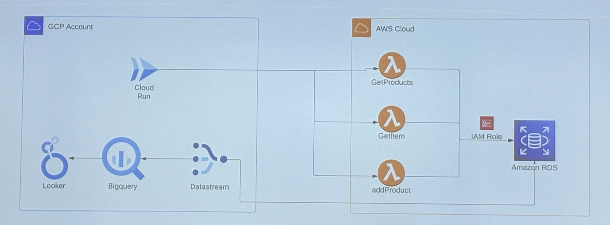

# Data Project 3 - Arquitectura Cloud Híbrida (GCP + AWS)

**Data Project 3 del Master Big Data y Cloud de EDEM**

**Autor:** [Miguel Torres Cuello](https://www.linkedin.com/in/migueltorrescuello/)

## Índice

- [📋 Descripción General](#descripción-general)
- [🏗️ Arquitectura](#arquitectura)
- [⚙️ Componentes](#componentes)
- [🔄 Flujo de la Arquitectura](#flujo-de-la-arquitectura)
- [📁 Estructura del Proyecto](#estructura-del-proyecto)
- [🚀 Guía de Deployment Paso a Paso](#guía-de-deployment-paso-a-paso)

## Descripción General
Este proyecto implementa una arquitectura híbrida de ingeniería de datos combinando Google Cloud Platform (GCP) y Amazon Web Services (AWS) para crear un pipeline completo de datos de ecommerce.

## Arquitectura
El sistema consta de:

1. **Infraestructura como Código**: Toda la infraestructura se gestiona usando Terraform
2. **Frontend**: Aplicación web Flask simulando una plataforma de ecommerce
3. **Backend**: Funciones Lambda de AWS para la lógica de negocio
4. **Base de Datos**: Amazon RDS con autenticación IAM
5. **Pipeline de Analítica**: GCP Datastream → BigQuery → Looker

## Componentes

### Aplicación Web (GCP Cloud Run)
- Aplicación Flask que simula un ecommerce
- Alojada en Google Cloud Run
- Proporciona interfaz web para gestión de productos

### Capa API (AWS Lambda)
Tres funciones Lambda manejan las operaciones principales:
- **GetProducts**: Obtener todos los productos disponibles de la base de datos
- **GetItem**: Simular compra de producto (marca el artículo como no disponible)
- **AddProduct**: Añadir nuevos productos al catálogo

### Capa de Base de Datos (AWS RDS)
- Base de datos PostgreSQL en Amazon RDS
- Autenticación basada en roles IAM
- Almacena catálogo de productos y datos de transacciones

### Pipeline de Analítica (GCP)
- **Datastream**: Replicación de datos en tiempo real desde RDS a BigQuery
- **BigQuery**: Data warehouse para analítica
- **Looker**: Inteligencia de negocio y visualización

## Flujo de la Arquitectura


## Estructura del Proyecto
```
.
├── terraform/
│   ├── main.tf
│   ├── variables.tf
│   ├── outputs.tf
│   ├── providers.tf
│   └── terraform.tfvars.example
├── app/
│   ├── flask-app/
│   └── lambda-functions/
├── docs/
│   └── arquitectura-dp3.jpg
├── dashboard/
│   └── dashboard-dp3.pdf
├── .gitignore
└── README.md
```

## Guía de Deployment Paso a Paso

### Prerrequisitos

Antes de comenzar, asegúrate de tener instalado y configurado:

- [Terraform](https://www.terraform.io/downloads.html) >= 1.0
- [AWS CLI](https://aws.amazon.com/cli/) configurado con credenciales
- [Google Cloud SDK](https://cloud.google.com/sdk/docs/install) configurado
- [Docker](https://docs.docker.com/get-docker/) para construcción de imágenes
- [Git](https://git-scm.com/downloads)
- **PostgreSQL Client (psql)** para configuración de replicación:
  - **Linux (Ubuntu/Debian)**: `sudo apt-get install postgresql-client`
  - **Windows**: Descargar e instalar desde [postgresql.org](https://www.postgresql.org/download/windows/)

### Paso 1: Clonar el Repositorio

```bash
git clone <URL-DEL-REPOSITORIO>
cd data-project-3
```

### Paso 2: Configurar Credenciales AWS

```bash
# Configurar AWS CLI
aws configure
# Introducir: Access Key ID, Secret Access Key, Region (eu-central-1), Output format (json)

# Verificar configuración
aws sts get-caller-identity
```

### Paso 3: Configurar Google Cloud

```bash
# Autenticarse en Google Cloud
gcloud auth login
gcloud auth application-default login

# Crear proyecto GCP (opcional, o usar uno existente)
gcloud projects create tu-proyecto-id --name="Data Project 3"

# Configurar proyecto por defecto
gcloud config set project tu-proyecto-id

# Habilitar APIs necesarias
gcloud services enable cloudbuild.googleapis.com
gcloud services enable run.googleapis.com
gcloud services enable artifactregistry.googleapis.com
gcloud services enable bigquery.googleapis.com
gcloud services enable datastream.googleapis.com
gcloud services enable compute.googleapis.com
```

### Paso 4: Configurar Variables de Terraform

```bash
cd terraform

# Copiar archivo de variables de ejemplo
cp terraform.tfvars.example terraform.tfvars

# Editar con tus valores
nano terraform.tfvars  # o vim, code, etc.
```

**Configurar las siguientes variables en `terraform.tfvars`:**

```hcl
# Configuración del proyecto
project_name = "data-project-3"

# Configuración AWS
aws_region        = "eu-central-1"
aws_account_id    = "TU_AWS_ACCOUNT_ID"  # Obtener con: aws sts get-caller-identity
db_name           = "ecommerce"
db_username       = "ecommerceuser"
db_password       = "TU_CONTRASEÑA_SEGURA"
datastream_username = "datastream"
datastream_password = "TU_CONTRASEÑA_DATASTREAM"

# Configuración GCP
gcp_project_id = "tu-proyecto-gcp-id"
gcp_region     = "europe-west1"

# BigQuery
bigquery_dataset_id       = "ecommerce_analytics"
bigquery_dataset_location = "EU"

# Datastream
datastream_display_name = "ecommerce-rds-to-bq"

# Flask App
flask_app_port = 8080
flask_app_image = "europe-west1-docker.pkg.dev/tu-proyecto-gcp-id/data-project-3-repo/data-project-3-flask-app:latest"
```

### Paso 5: Crear Bucket para Estado de Terraform (Recomendado)

```bash
# Crear bucket para estado remoto de Terraform
gsutil mb -p tu-proyecto-gcp-id -c STANDARD -l europe-west1 gs://tu-proyecto-terraform-state

# Habilitar versionado
gsutil versioning set on gs://tu-proyecto-terraform-state

# Actualizar providers.tf con tu bucket
# Editar terraform/providers.tf y cambiar el nombre del bucket en la sección backend "gcs"
```

### Paso 6: Deployment con Terraform

```bash
# Inicializar Terraform
terraform init

# Revisar plan de deployment
terraform plan

# Aplicar cambios (esto tomará ~10-15 minutos)
terraform apply

# Confirmar con 'yes' cuando se solicite
```

**⚠️ Nota importante**: Si el deployment falla con error `psql: command not found`, asegúrate de tener instalado el cliente PostgreSQL:
- **Linux**: `sudo apt-get install postgresql-client`
- **Windows**: Instalar desde [postgresql.org](https://www.postgresql.org/download/windows/) y añadir al PATH

### Paso 7: Verificar Deployment

```bash
# Obtener URLs de los servicios
terraform output

# Las URLs importantes serán:
# - cloud_run_url: URL de la aplicación Flask
# - lambda_urls: URLs de las funciones Lambda
# - bigquery_dataset_url: URL del dataset en BigQuery
# - datastream_url: URL del stream de Datastream
```

### Paso 8: Probar el Sistema

1. **Probar aplicación Flask:**
   ```bash
   curl https://tu-cloud-run-url
   ```

2. **Probar funciones Lambda:**
   ```bash
   # Obtener productos
   curl https://tu-lambda-get-products-url
   
   # Añadir producto
   curl -X POST https://tu-lambda-add-product-url \
     -H "Content-Type: application/json" \
     -d '{"name": "Producto Test", "price": 99.99, "description": "Producto de prueba"}'
   ```

3. **Verificar datos en BigQuery:**
   ```bash
   bq query --use_legacy_sql=false \
     "SELECT * FROM \`tu-proyecto-gcp-id.ecommerce_analytics.public_products\` LIMIT 5"
   ```

### Paso 9: Configurar Looker Studio (Opcional)

1. Ir a [https://lookerstudio.google.com](https://lookerstudio.google.com)
2. Crear nuevo informe
3. Conectar con BigQuery
4. Seleccionar proyecto: `tu-proyecto-gcp-id`
5. Seleccionar dataset: `ecommerce_analytics`
6. Seleccionar tabla: `products_analytics` (vista con datos enriquecidos)
7. Crear visualizaciones según necesidades

### Paso 10: Limpieza

Para destruir todos los recursos cuando termines:

```bash
terraform destroy
```
